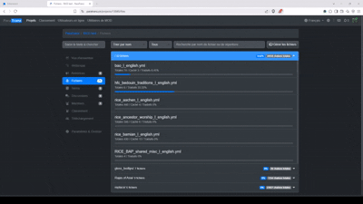
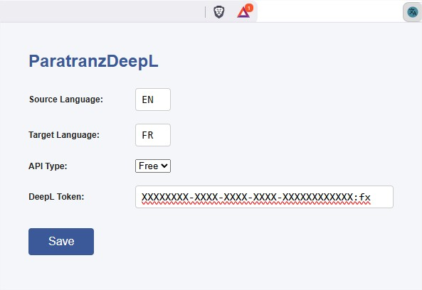

# Paratranz DeepL

> Translates new strings with DeepL

## Demo

[Click here](docs/Demo.mp4) to open the demo as a video.

## Install

Subscribe to [the Chrome extension](https://chromewebstore.google.com/detail/paratranzdeepl/inghghdkggehaibanbmfbhkjkopbkloi) on a Chromium web browser (Brave, Opera, Google Chrome, Edge, or ...)

## Configuration

Open the extension pop up and filled the form with

- Source language, the language of the text to translate ([available values here](https://developers.deepl.com/docs/api-reference/translate/openapi-spec-for-text-translation))
- Target language, the language of the translation ([available values here](https://developers.deepl.com/docs/api-reference/translate/openapi-spec-for-text-translation))
- API Type (Free or Pro)
- DeepL API Token according the API type

Save the changes, close the pop up and if you are on Paratranz, refresh the page.

## Developer install

Clone this project then follow [this tutorial](https://developer.chrome.com/docs/extensions/get-started/tutorial/hello-world#load-unpacked) to load the unpacked extension from the `chrome_extension` directory. 
